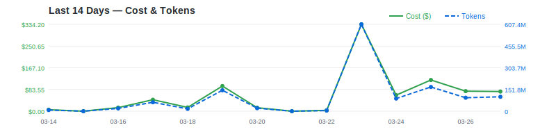
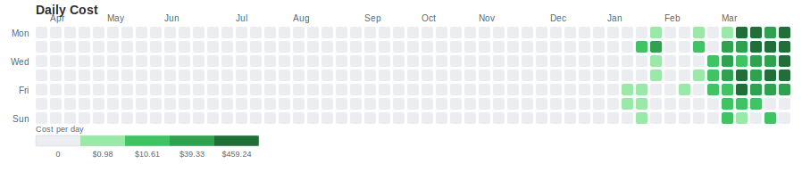
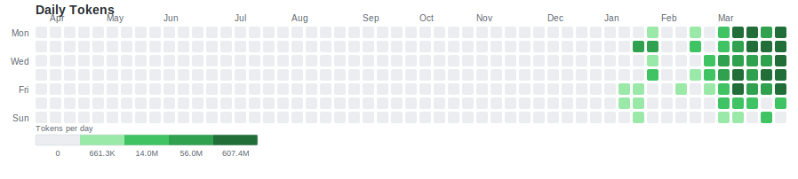

<p align="center">
  
</p>

<h1 align="center">Token Monitor</h1>

<p align="center">Track Claude Code daily token usage with GitHub-style contribution matrix.</p>

## Last 14 Days



## Daily Cost



## Daily Tokens



## Past 6 Months

| Month | Cost | Tokens | Active Days |
|-------|------|--------|-------------|
| 2025-10 | $0.00 | 0 | 0 |
| 2025-11 | $0.00 | 0 | 0 |
| 2025-12 | $0.00 | 0 | 0 |
| 2026-01 | $27.55 | 44.4M | 10 |
| 2026-02 | $85.83 | 110.7M | 13 |
| 2026-03 | $1,171 | 1.78B | 25 |
| **Total** | **$1,284** | **1.94B** | **48** |

## Setup

Requires [ccusage](https://github.com/ryoppippi/ccusage) to be installed.

```bash
npm install -g ccusage
```

## Usage

```bash
# One-shot: fetch data, generate charts, update README
python monitor.py

# Then commit and push
git add data/ assets/ README.md && git commit -m "update usage $(date +%Y-%m-%d)" && git push
```

## Auto Update (every 10 min)

```bash
# Start background loop
nohup ./auto-loop.sh &

# Check logs
tail -f auto-update.log

# Stop
kill $(cat .loop.pid)
```

## Data

Raw usage data: [`data/usage.json`](data/usage.json)
